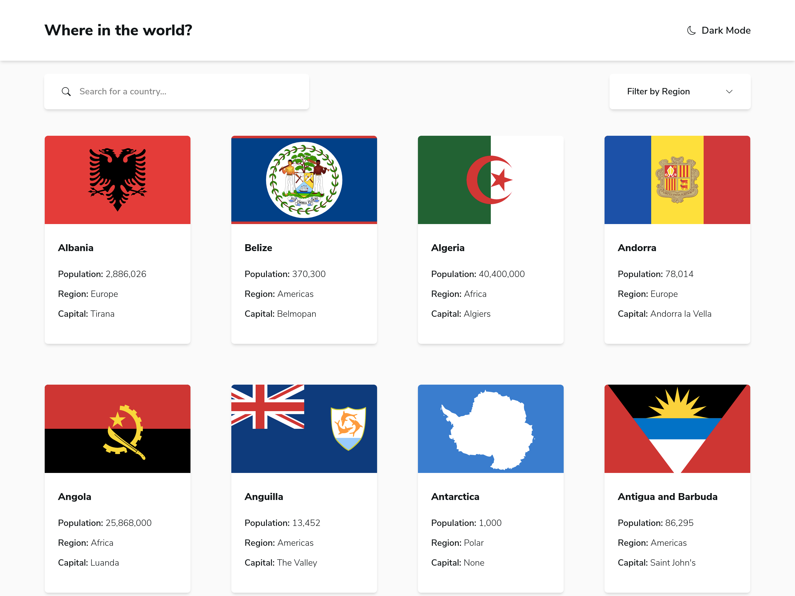
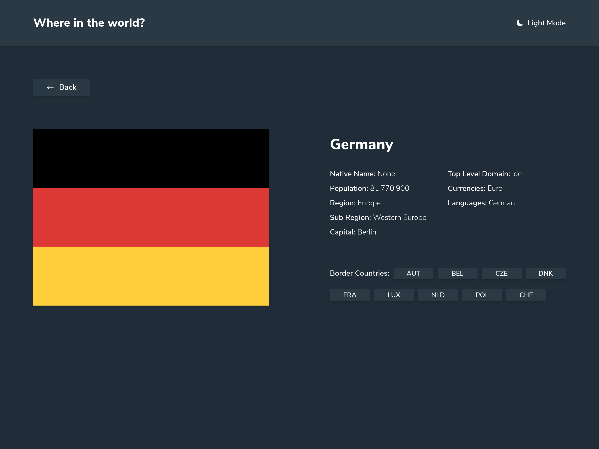

# Frontend Mentor - Countries API with color theme switcher

Essa é uma solução do desafio [Countries API with color theme switcher](https://www.frontendmentor.io/challenges/rest-countries-api-with-color-theme-switcher-5cacc469fec04111f7b848ca) por [Frontend Mentor](https://www.frontendmentor.io).

## Sumário

- [Visão geral](#visão-geral)
  - [O site](#o-site)
  - [A proposta](#a-proposta)
  - [Screenshots](#screenshots)
- [A proposta](#a-proposta)
  - [Feito com ](#feito-com)
  <!-- - [O que aprendi](#o-que-aprendi)
  - [Desenvolvimento contínuo](#desenvolvimento-contínuo) -->
<!--   - [Recursos úteis](#recursos-úteis) -->
<!-- - [Autor](#autor) -->

## Visão geral

### O site
- Quer testar minha aplicação? Clique [aqui](https://graphql-countries-api-with-color-theme-switcher-adryanrosa.vercel.app/)

### A proposta

Usuários devem ser capazes de:

<!-- - View the optimal layout for the site depending on their device's screen size -->
- Ver todos os países da API na Home
- Pesquisar por países usando o campo de input
- Filtrar países por região
- Clicar num país para ver mais informações em uma nova página
- Navegar pelos países que fazem fronteira na página de detalhes
- Mudar entre modo claro e escuro

### Screenshots




## O processo

### Feito com

- [Next.js](https://nextjs.org/) - Framework React
- [Sass](https://sass-lang.com/) - Pré-processador CSS
- [PostCss](https://postcss.org/) - Pós-processador CSS
- [Gulp](https://gulpjs.com/) - Toolkit de automação de tarefas JavaScript
- Workflow Mobile-first
- [BEM](http://getbem.com/introduction/) - Metodologia CSS

<!-- ### O que aprendi

Use this section to recap over some of your major learnings while working through this project. Writing these out and providing code samples of areas you want to highlight is a great way to reinforce your own knowledge.

To see how you can add code snippets, see below:

```html
<h1>Some HTML code I'm proud of</h1>
```
```css
.proud-of-this-css {
  color: papayawhip;
}
```
```js
const proudOfThisFunc = () => {
  console.log('🎉')
}
```

### Desenvolvimento contínuo

Use this section to outline areas that you want to continue focusing on in future projects. These could be concepts you're still not completely comfortable with or techniques you found useful that you want to refine and perfect. -->

<!-- ### Recursos úteis

- [Sass Masterclass - Rocketseat](https://www.youtube.com/watch?v=BaI8dHUthLA) - Essa aula me ajudou a entender @mixins, @include, @extends, etc. funcionalidades do Sass para facilitar a organização do projeto e evitar repetições. Vou continuar utilizando-as daqui pra frente. -->

<!-- ## Autor

- Website - [Add your name here](https://www.your-site.com)
- Frontend Mentor - [@yourusername](https://www.frontendmentor.io/profile/yourusername)
- Twitter - [@yourusername](https://www.twitter.com/yourusername) -->
